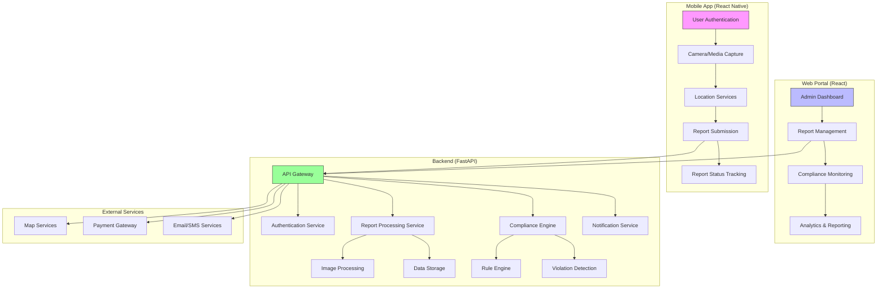

# Billboard Compliance System Architecture

## System Overview

## Component Descriptions

### 1. Mobile App (React Native)
- **User Authentication**: Secure login and session management
- **Camera/Media Capture**: Document and photo capture with metadata
- **Location Services**: GPS tagging and geofencing
- **Report Submission**: Secure data transmission
- **Offline Support**: Queue and sync when online

### 2. Web Portal (React)
- **Admin Dashboard**: Overview of compliance status
- **Report Management**: Review and process reports
- **User Management**: Role-based access control
- **Analytics**: Generate compliance reports

### 3. Backend Services (FastAPI)
- **API Gateway**: Request routing and rate limiting
- **Authentication**: JWT-based auth and RBAC
- **Report Processing**: Handle submissions and validations
- **Compliance Engine**: Rule-based violation detection
- **Notification Service**: Alerts and status updates

### 4. Data Storage
- **PostgreSQL**: Relational data storage
- **MongoDB**: Unstructured report data
- **S3/Blob Storage**: Media files and documents
- **Redis**: Caching and real-time features

### 5. External Integrations
- **Map Services**: Location data and geocoding
- **Payment Gateway**: Processing fees and fines
- **SMS/Email**: Notifications and alerts
- **Analytics**: Business intelligence

## Data Flow

1. **Report Submission**
   - User captures media and metadata
   - Data is validated and processed
   - Report is stored and queued for review

2. **Compliance Check**
   - System retrieves applicable rules
   - Automated checks against compliance criteria
   - Flags potential violations

3. **Review Process**
   - Compliance officers review flagged reports
   - Manual verification if needed
   - Decision and next steps recorded

4. **Notification**
   - Status updates to reporters
   - Alerts for violations
   - Escalation for critical issues

## Security Measures

- End-to-end encryption
- Regular security audits
- Data retention policies
- Access logging and monitoring
- Regular backups

## Scalability Considerations

- Microservices architecture
- Load balancing
- Database sharding
- CDN for static assets
- Queue-based processing
